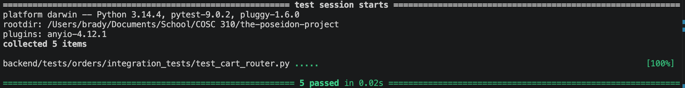

Tests for Cart Router

There are two add item to cart tests.
The positive equivalence partitioning test ensures that an item can be successfully added to the user's cart via the router and returns a 200 OK status. 
The exception handling test ensures that a proper 404 Not Found error is returned if the user attempts to add a menu item that does not exist.

There is one update cart item quantity test.
This positive equivalence partitioning test ensures that a user can successfully update the quantity of an existing item in their cart and returns a 200 OK status.

There is one remove cart item test.
This positive equivalence partitioning test ensures that a specific item can be successfully removed from the user's cart via the router.

There is one clear customer cart test.
This functional test ensures that the endpoint to completely clear a user's cart executes successfully and returns a 200 OK status.