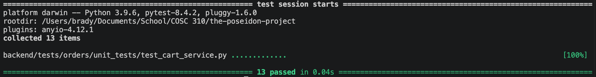

Tests for Cart Service

There are six add to cart tests.
The functional tests ensure that a brand new item can be added successfully, and that adding an existing item correctly increments the quantity rather than duplicating the entry.
The exception handling tests use fault injection to ensure proper errors are thrown when a user is not found, a menu item is not found, or a menu item's availability is marked as false.
There is also a business logic constraint test that ensures an error is thrown if a user attempts to cross-order by adding an item from a different restaurant than what is currently in their cart.

There are three update quantity tests.
The successful functional test ensures a user can properly change the quantity of an existing item.
An edge case test is used to ensure that updating an item's quantity to zero successfully triggers the removal of that item from the cart.
An exception handling test ensures an error is thrown if the user tries to update an item that is not currently in their cart.

There are three remove from cart tests.
The positive tests ensure that a specific item can be completely removed, and that removing one item successfully preserves any other existing items in the cart array.
The exception handling test ensures a proper error is thrown when attempting to remove an item that does not exist in the cart.

There is one clear cart test.
This is a successful functional test to ensure that the entire items array is wiped properly while preserving the user's cart ownership ID.