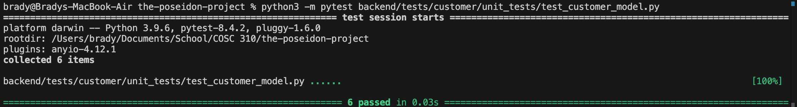

Tests for customer model

tests/customer/unit_tests/test_customer_model.py

*Customer Initialization:*
This test will ensure all attributes are initialized properly, with attributes such as phone, address, city, postal code, being passed through `test_customer_data`.

*Edge case invalid testing:* All tests that follow the structure `test_customer_init_invalid_xxx` test the invalid edge cases for the String values in `customer.py`, such as phone, address, city, all not allowing empty or whitespace strings.