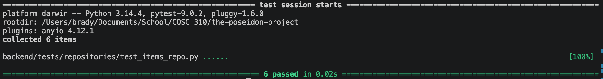

Items repository test documentation

Mocking is used in all of the below tests

We have a valid equivalence test with a valid input class. We use mocking to create fake data and ask it to return the value and load it all. This shows that we get the proper number of results, alongside item name and restaurant id.

We have an invalid equivalence test with an missing input classs that tries to load a file that doesnt exist. It should return an empty file because we did not make any mock data

We have a fault injection test that also handles exceptions by using a corrupted JSON file and ensures that it throws the proper error

We have a functionality test that ensures we can correctly write data into the file.

--Added later:--
Find by ID tests have been added, one positive and negative functional test.

