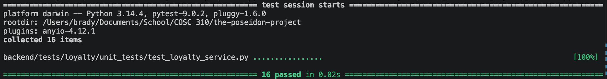

Loyalty Service Testing

There are four point calculation tests.
The functional tests ensure that points are calculated accurately based on the standard 10x multiplier on positive subtotals. A configuration test is also included to prove that the service can dynamically adjust its math if the points-per-dollar multiplier is changed. The boundary value analysis tests ensure that a $0.00 subtotal returns zero points and that negative subtotals are handled gracefully without causing calculation errors.

There are eight tier evaluation tests.
The parameterized boundary tests verify the exact cut-off points for the tiered progression system. These ensure that users are kept in 'Bronze' until the exact moment they hit 500 points, promoted to 'Silver' at the threshold, and promoted to 'Gold' once they hit 1000 points. A functional test ensures that these thresholds remain dynamic and respect custom configurations.

There are five benefit application tests.
The equivalence partitioning tests verify that the specific perks for each tier are applied correctly to the cost breakdown: 'Bronze' preserves original pricing, 'Silver' successfully waives the delivery fee, and 'Gold' applies both a flat 10% subtotal discount and a delivery fee waiver.
The robustness and exception handling tests ensure the service is resilient; it verifies that the calculator won't crash if passed a non-existent tier name or a partial cost dictionary with missing keys, falling back to safe default values ($0.0) instead.