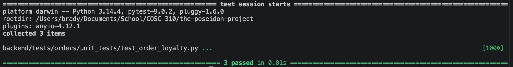

Order Loyalty Testing (EXTRA FEATURE)

There is one order creation test.
This functional test ensures that potential points are calculated from the subtotal and correctly stored in the loyalty_points_earned attribute when the order is first generated.

There are two order update tests.
The positive flow test verifies that moving an order to COMPLETED successfully deposits points into the user's account and triggers an automatic tier promotion if thresholds are met. The negative flow test ensures that CANCELLED orders do not award any points to the user.

There is a schema validation check.
These tests use fault injection to ensure that adding loyalty logic doesn't break Pydantic validation. They confirm the service still requires mandatory fields like UUIDs, restaurant IDs, and coordinates before returning a valid Order object.