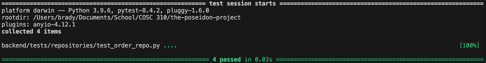

Test documentation for order repo

This test file thoroughly validates the data persistence layer within the `OrderRepository` class, focusing heavily on file I/O operations and JSON serialization.

It utilizes `unittest.mock.patch` and `mock_open` to ensure the tests can verify read and write operations without actually creating or modifying real data files. The tests apply Equivalence Partitioning to confirm the repository correctly handles both ideal scenarios (loading valid JSON data and saving serialized data) and expected edge cases (handling a missing file gracefully). Furthermore, it employs Fault Injection by simulating corrupted data to trigger a `JSONDecodeError`, verifying that the repository's exception handling safely catches the crash and returns an empty list.