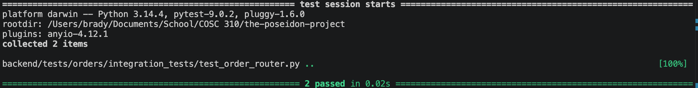

Tests for Order Router

There is one create order test.
This positive equivalence partitioning test ensures that a valid order payload is successfully routed, creates a new order in the system, and returns a proper 201 Created status code along with the generated order ID.

There is one update order test.
This positive equivalence partitioning test ensures that an existing order's status (such as moving it to "completed") can be updated successfully through the router and returns a 200 OK status.