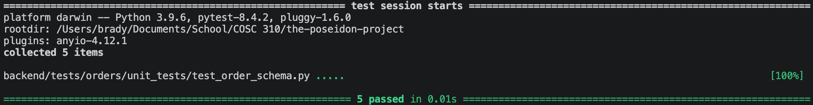

Test documentation for order schema

This new test file thoroughly validates the Pydantic schemas used for creating and updating orders (`OrderCreate`, `OrderUpdate`).

It will check that OrderCreate creates an order successfully, and that OrderUpdate updates attributes of an order successfully.