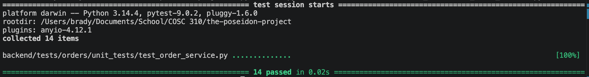

Test documentation for order service

This test file validates the core business logic within the `OrderService` class, covering order creation, status updates, and custom ID generation.

It utilizes dependency injection and `unittest.mock.MagicMock` to isolate the service from the data layer. By passing a fake `OrderRepository` into the service, the tests can safely verify the logic without accidentally reading from or writing to the real JSON data files.

It applies Boundary Value Analysis and Equivalence Partitioning via `pytest.mark.parametrize` to rigorously test the static validation rules for coordinates and Canadian postal codes. Additionally, it uses fault injection to test exception handling, ensuring the service safely raises the correct FastAPI `HTTPException` errors (such as a 404 when an order cannot be found, or a 400 when validation fails) instead of crashing the backend system.

It also includes tests that check that update_order will fail if the order's status is COMPLETED or CANCELLED.