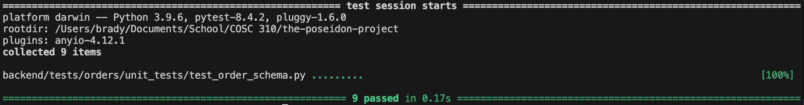

Test documentation for order schema

This new test file thoroughly validates the Pydantic schemas used for creating and updating orders (`OrderCreate`, `OrderUpdate`, `OrderItemCreate`, `OrderItemUpdate`).

It will check that OrderCreate creates an order successfully, and that OrderUpdate updates attributes of an order successfully.

It will also check that OrderItems can be created, and that only the quantity can be modified with OrderItemUpdate.